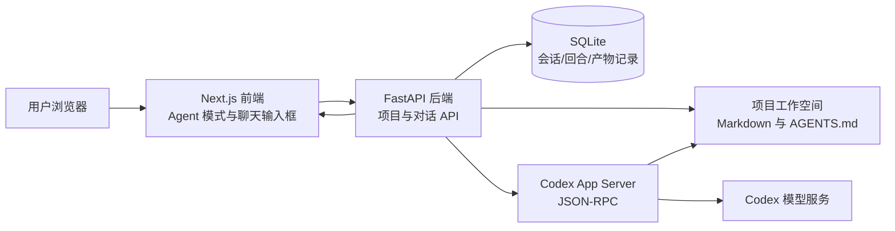
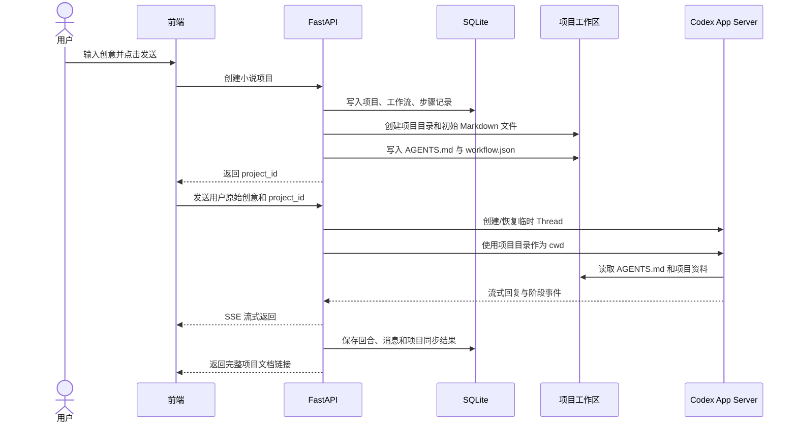
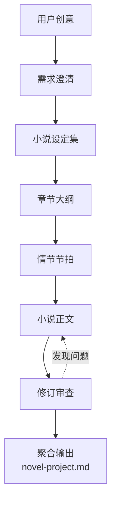
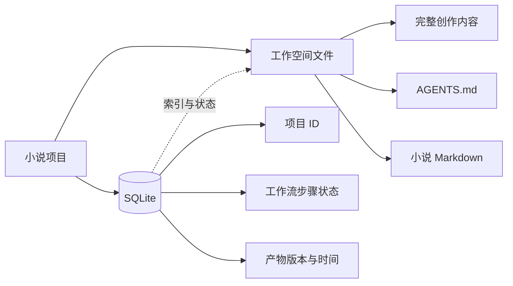

# 2026-09-13 小说 Agent 工作流与 Codex 接入总结

> 本文用于项目交接，记录 2026 年 9 月 13 日完成的功能、代码位置、页面操作、验证结果和当前边界。

## 1. 今天完成了什么

今天的工作重点，是把“普通聊天页面”整理成一个可以承载小说创作 Agent 的入口，并把小说项目、独立工作空间、本地 Codex App Server、SQLite 数据和最终 Markdown 文件串起来。

完成内容如下：

1. 页面增加“Agent 模式”，可以选择“自由对话”或“生成剧本”。
2. 生成剧本时，可以设置章节数和目标字数。
3. 用户输入的创意会先创建小说项目，再自动发起 Agent 对话。
4. 小说项目拥有独立的本地工作空间，不再把文件写到任意位置。
5. 每个项目会生成 `AGENTS.md`，记录这个项目的工作规则和创作阶段。
6. 后端增加小说项目 API、项目服务和质量检查服务。
7. Codex Thread 使用项目工作空间作为 `cwd`，并按项目目录提供受限可写权限。
8. 网站会把 Codex 的回复流式展示，公开的思考过程可以折叠查看。
9. 前端支持 Markdown 展示。
10. 生成完成后，后端会把完整项目文档链接写回对话消息。
11. 增加文件访问接口，浏览器可以通过网站地址打开生成的 Markdown 文件。
12. 增加后端、前端和小说项目相关测试。

## 2. 整体工作方式

可以把系统理解成四层：



关键点：模型并不是在本机运行。当前本机运行的是 Codex App Server，它负责把请求转交给 Codex 使用的模型服务；本地项目负责页面、任务编排、文件管理和数据记录。

## 3. 页面上的使用流程

### 3.1 选择 Agent 模式

首页聊天输入框顶部现在有三类控制：

```text
┌─────────────────────────────────────────────┐
│ Agent 模式   生成剧本   本地 Codex Agent     │
│                                             │
│ 章节：6      目标字数：6000                  │
│                                             │
│ 输入你的创意，例如：一只猫在雨城寻找主人……  │
│                                      [发送] │
└─────────────────────────────────────────────┘
```

- `Agent 模式`：当前统一的 AI 工作入口。
- `生成剧本`：选择小说/剧本创作工作流。
- `本地 Codex Agent`：当前连接本地 Codex App Server。
- `章节`：告诉 Agent 需要拆成多少个章节。
- `目标字数`：告诉 Agent 大约输出多少字。

### 3.2 点击发送后发生什么



这里有一个重要改动：内部工作流说明不再作为一大段用户提示词发送给模型。用户输入的内容只保留为用户创意；工作流程写在项目工作区的 `AGENTS.md` 和状态文件里，由 Agent 在项目上下文中读取。

## 4. 小说项目的工作空间

每次创建小说项目，后端会在 `runtime/creative-projects/` 下创建一个独立目录。示例：

```text
runtime/creative-projects/生成一个猫历险记的剧本-2/
├── AGENTS.md                         # 项目级 Agent 工作规则
├── project.json                      # 项目基本信息
├── .zaojing/context_manifest.json    # 上下文入口清单
├── state/
│   ├── creative-brief.md             # 需求澄清
│   ├── workflow.json                 # 工作流状态
│   └── revision-report.md            # 修订审查
├── canon/
│   └── novel-bible.md                # 小说设定集
├── structure/
│   ├── chapter-outline.md            # 章节大纲
│   └── plot-beats.md                 # 情节节拍
└── exports/
    ├── novel.md                      # 可直接阅读的小说正文
    └── novel-project.md              # 聚合后的完整项目文档
```

这些文件是 Agent 的长期记忆载体：下一次继续对话时，可以从项目工作区读取前面的设定，而不是只依靠聊天窗口里的历史消息。

## 5. Agent 的小说工作流

当前工作流定义为六个阶段：



每个阶段的职责：

| 阶段 | 主要产物 | 作用 |
|---|---|---|
| 需求澄清 | 创意、题材、读者、篇幅、视角、基调 | 确定创作边界 |
| 小说设定集 | 人物、世界观、关系网、主题、连续性事实 | 防止后续设定漂移 |
| 章节大纲 | 每章目标、冲突、人物变化、悬念 | 保证整体结构连贯 |
| 情节节拍 | 开端、转折、高潮、余韵和关键描写 | 把大纲拆成可执行单元 |
| 小说正文 | Markdown 小说正文 | 形成用户可以直接阅读的作品 |
| 修订审查 | 人物弧光、伏笔、节奏、设定冲突检查 | 发现问题并推动修订 |

## 6. 代码改动位置

### 后端

| 文件 | 作用 |
|---|---|
| `apps/api/app/api/routes/creative_projects.py` | 小说项目创建、查询和 Markdown 文件访问接口 |
| `apps/api/app/services/creative_project_service.py` | 创建项目工作空间、初始化文件和生成 Agent 工作规则 |
| `apps/api/app/services/quality_gate_service.py` | 对产物进行基础质量检查 |
| `apps/api/app/services/codex_app_server.py` | 连接本地 Codex App Server，配置项目 `cwd` 和沙箱写入范围 |
| `apps/api/app/services/conversation_service.py` | 管理对话、流式事件、项目同步和最终文档链接 |
| `apps/api/app/db/database.py` | SQLite 表结构与数据库初始化 |
| `apps/api/app/db/repositories.py` | 项目、工作流、步骤和产物的数据库访问 |
| `apps/api/app/core/config.py` | 查找本地 Codex 可执行文件和运行配置 |

### 前端

| 文件 | 作用 |
|---|---|
| `apps/web/widgets/workspace/chat-workspace.tsx` | 页面总入口，负责 Agent 模式和剧本发送流程 |
| `apps/web/features/chat/components/chat-composer.tsx` | 聊天输入框、Agent 类型、模型和剧本参数选择 |
| `apps/web/features/creative-projects/hooks/use-director-workflow.ts` | 创建小说项目并把用户创意交给聊天流程 |
| `apps/web/features/creative-projects/api/creative-projects.ts` | 前端调用小说项目 API |
| `apps/web/features/chat/model/message-events.ts` | 处理流式事件和项目文档链接 |
| `apps/web/shared/ui/markdown-content.tsx` | Markdown 渲染和旧路径链接转换 |
| `apps/web/app/globals.css` | Agent 模式和输入区样式 |

### 文档

| 文件 | 作用 |
|---|---|
| `docs/creative-agent-workflow-design-v2.md` | 小说 Agent 工作流设计 |
| `docs/creative-agent-implementation-status.md` | 功能实施状态 |
| `docs/director-agent-workflow.md` | 导演/创作 Agent 的阶段说明 |
| `docs/2026-09-13-小说Agent工作流与Codex接入总结.md` | 本次交接总结 |

## 7. 数据与文件如何配合

SQLite 和 Markdown 各自承担不同职责：



SQLite 主要回答“项目现在处于什么状态、有哪些步骤、有哪些版本”；Markdown 主要保存“实际创作内容”。这样既方便页面查询，也方便用户直接检查和编辑文件。

## 8. 文件访问方式

生成后的完整项目文档通过后端安全接口访问，不再把本机绝对路径拼成浏览器 URL。

通用格式：

```text
http://127.0.0.1:3000/api/creative-projects/{project_id}/files/exports/novel-project.md
```

例如：

```text
http://127.0.0.1:3000/api/creative-projects/b41b9cf8-2712-4c31-ac68-ec527defb9f1/files/exports/novel-project.md
```

安全规则：

- 只允许访问 `runtime/creative-projects/` 下的项目文件。
- 只允许 Markdown、JSON、TXT 等白名单扩展名。
- 禁止通过 `..` 访问项目目录之外的文件。
- 前端显示稳定的 API 地址，不显示本机绝对路径。

## 9. 今天的验证结果

已完成以下检查：

```text
后端测试：35 passed
Ruff：通过
前端类型检查：通过
前端构建：通过
前端 Node 测试：4 passed
Markdown 文件接口：HTTP 200，Content-Type: text/markdown
```

健康检查接口：

```text
http://127.0.0.1:8000/health
```

重点确认项：

- 本地 Codex 可执行文件能够被后端发现。
- Codex App Server 已登录并可连接。
- 项目工作空间被作为 Codex 的工作目录。
- 项目目录加入了受限可写范围。
- 生成文档通过网站 API 可访问。

## 10. 当前还没有完全解决的部分

当前完成的是“小说 Agent 工作流基础闭环”，还不是完整的即梦级创作平台。以下内容仍属于后续工作：

1. 阶段之间的自动质量评分和自动返工策略还比较基础。
2. 前端还需要展示更完整的阶段进度、任务状态和失败重试按钮。
3. 需要进一步实现用户只在关键决策点确认，普通阶段由 Agent 自动推进。
4. Skill 和知识库还没有形成完整的安装、检索和版本管理机制。
5. 图片、视频、图生图、图生视频、多模态分析尚未接入真实供应商。
6. 多模型供应商的凭证管理和模型路由仍需继续扩展。
7. 生成内容的版本对比、回滚和人工编辑体验还可以加强。

## 11. 伙伴接手后的建议验证顺序

1. 启动后端和前端，打开 `http://127.0.0.1:3000`。
2. 选择 `Agent 模式` 和 `生成剧本`。
3. 输入一个简单创意，例如“写一只猫寻找主人的温情冒险故事”。
4. 设置章节数和目标字数，点击发送。
5. 确认页面立即进入对话，而不是只创建草稿。
6. 确认用户消息只显示原始创意，不显示内部工作流长提示词。
7. 确认回复可以流式显示，公开思考过程默认折叠。
8. 确认回复末尾出现“打开完整项目文档”链接。
9. 点击链接，确认可以打开 `novel-project.md`。
10. 在项目目录检查 `AGENTS.md`、`state/`、`canon/`、`structure/`、`exports/` 文件是否存在。

## 12. 一句话总结

今天把系统从“一个能和 Codex 聊天的页面”，推进成了“用户输入创意后，自动创建小说项目、绑定独立工作空间、调用本地 Codex、按阶段产出 Markdown 文件，并通过网站链接查看结果”的 Agent 工作流基础版本。

